# AI Orchestration Workbench — 제품 소개서

## 한 줄 요약

기획서를 넣으면 여러 AI가 자동으로 분석 → 비판 → 보강 → 검증 → 최종 계획을 만들어주는 데스크톱 앱입니다.

---

## 왜 만들었나

### 문제

개발팀에서 기획서나 이슈를 받으면, 실행 계획을 만들기까지 이런 과정을 거칩니다:

1. AI CLI에 기획서를 붙여넣고 분석 요청
2. 결과를 읽고, 빠진 부분이 있으면 다시 요청
3. 다른 AI에도 같은 문서를 넣어서 비교
4. 최종 계획서를 직접 정리

**문제점:**
- 매번 수동으로 복사-붙여넣기 반복
- AI마다 다른 CLI 사용법을 외워야 함
- 5단계 오케스트레이션을 수동으로 하면 1~2시간 소요
- 결과물이 파일로 정리되지 않아 추적이 어려움

### 해결

**AI Orchestration Workbench**는 이 전체 과정을 자동화합니다.

- 기획서 드래그 → 버튼 한 번 → 5단계 자동 완료
- 결과는 Markdown 파일로 자동 저장
- 진행 상황을 실시간으로 확인
- 여러 AI의 결과를 한 화면에서 비교

---

## 핵심 기능

### 1. 순차 오케스트레이션

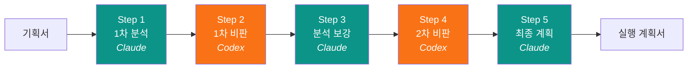

- 분석 AI와 검토 AI가 번갈아 5단계를 수행
- 각 단계가 이전 단계의 결과를 입력으로 받아 품질을 높임
- **비판 검토**가 포함되어 AI의 환각(hallucination)과 누락을 잡아냄

**프리셋 5종:**

| 프리셋 | 용도 |
|--------|------|
| 기본 5단계 비판형 | 일반적인 기술 분석 |
| 빠른 3단계 경량형 | 간단한 작업 |
| QA/버그 대응형 | 버그 분석 → 원인 검증 → 수정 계획 |
| 기능 기획 검증형 | 새 기능 실현 가능성 검토 |
| 리팩터링 계획형 | 구조 개선 설계 |

### 2. 병렬 비교

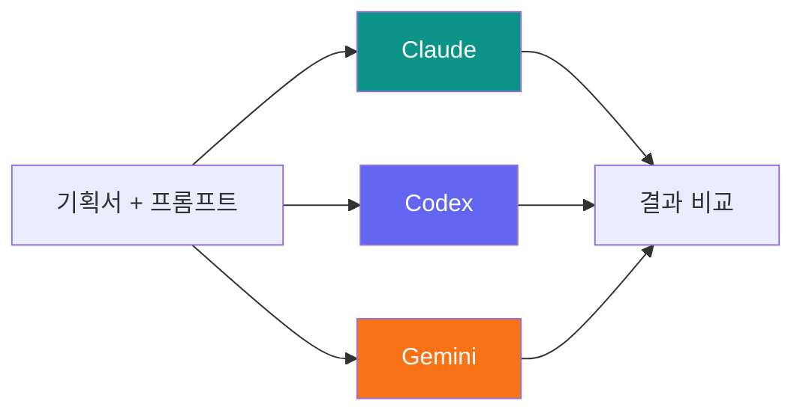

- 동일한 문서를 여러 AI에 동시 실행
- Agent별 탭으로 결과 비교
- 실행 시간 표시
- 어떤 AI가 더 좋은 분석을 하는지 판단 가능

### 3. 실시간 진행 상황

- 사이드 레일에 진행률 링 표시
- 순차: 원형 프로그레스 (N/M 단계)
- 병렬: Agent 수만큼 분할된 세그먼트 링 (각각 성공/실패 색상)
- 중단 버튼으로 언제든 멈출 수 있음

### 4. 프롬프트 관리

- 5단계 각각의 프롬프트를 앱에서 확인/편집 가능
- 수정한 프롬프트는 저장되어 다음에 자동 사용
- 기본 템플릿으로 되돌리기 가능

---

## 대상 사용자

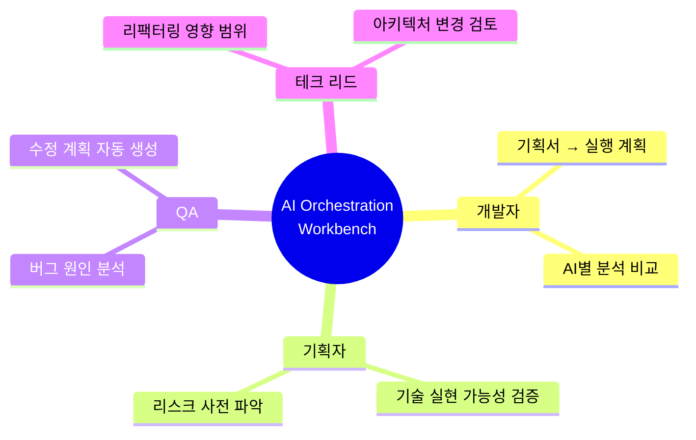

---

## 동작 흐름

### 순차 오케스트레이션

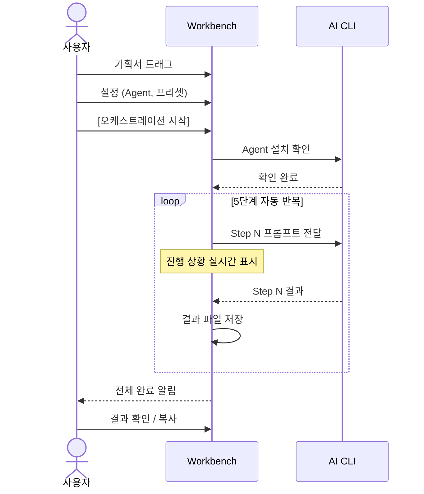

### 병렬 비교

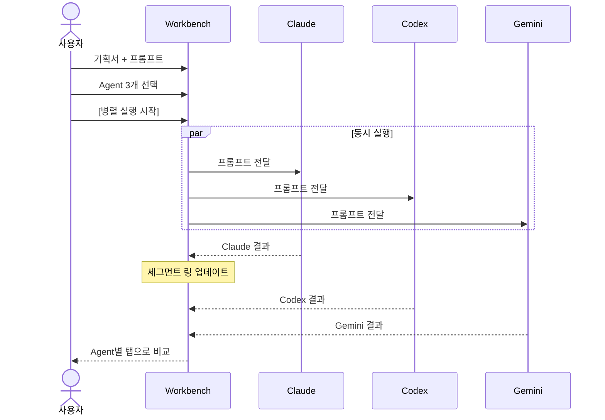

---

## 기술 아키텍처

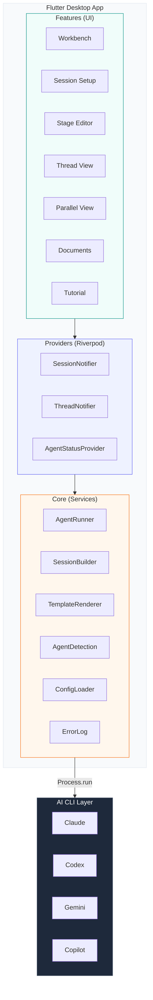

### 상태 관리

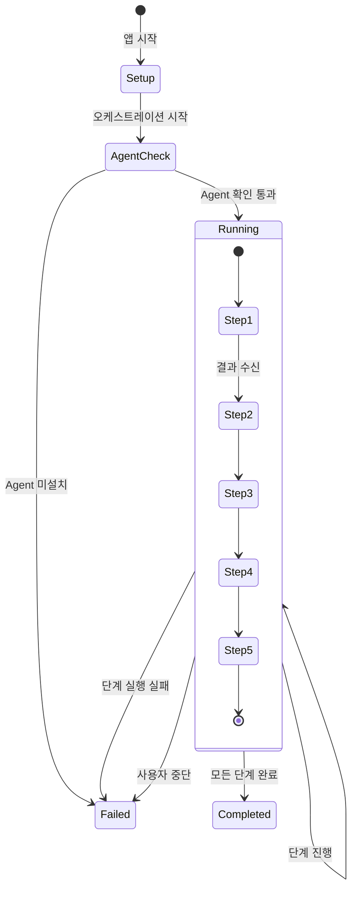

### AI CLI 실행 방식

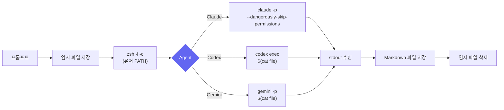

---

## 결과물 구조

```mermaid
graph TD
    S["session_20260327_143000_기획서명/"]
    S --> A[00_session_summary.md]
    S --> B["01_analysis_prompt.md"]
    S --> C["02_critical_review_prompt.md"]
    S --> D["03_reinforced_analysis_prompt.md"]
    S --> E["04_second_review_prompt.md"]
    S --> F["05_final_plan_prompt.md"]
    S --> G["04_execution_guide.md"]
    S --> H["11_analysis_result.md"]
    S --> I["12_critical_review_result.md"]
    S --> J["13_reinforced_analysis_result.md"]
    S --> K["14_second_review_result.md"]
    S --> L["15_final_plan_result.md"]

    style A fill:#f1f5f9,stroke:#94a3b8
    style B fill:#f0fdfa,stroke:#0d9488
    style C fill:#f0fdfa,stroke:#0d9488
    style D fill:#f0fdfa,stroke:#0d9488
    style E fill:#f0fdfa,stroke:#0d9488
    style F fill:#f0fdfa,stroke:#0d9488
    style G fill:#fef3c7,stroke:#f59e0b
    style H fill:#dcfce7,stroke:#22c55e
    style I fill:#dcfce7,stroke:#22c55e
    style J fill:#dcfce7,stroke:#22c55e
    style K fill:#dcfce7,stroke:#22c55e
    style L fill:#dcfce7,stroke:#22c55e
```

| 색상 | 의미 |
|------|------|
| 회색 | 세션 메타 |
| 청록 | 프롬프트 (입력) |
| 노란 | 실행 가이드 |
| 녹색 | AI 결과 (출력) |

---

## 향후 로드맵

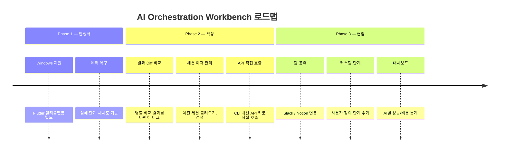

---

## 요약

**AI Orchestration Workbench**는 "기획서 하나 넣으면 AI가 알아서 분석-검증-계획까지 만들어주는 도구"입니다.

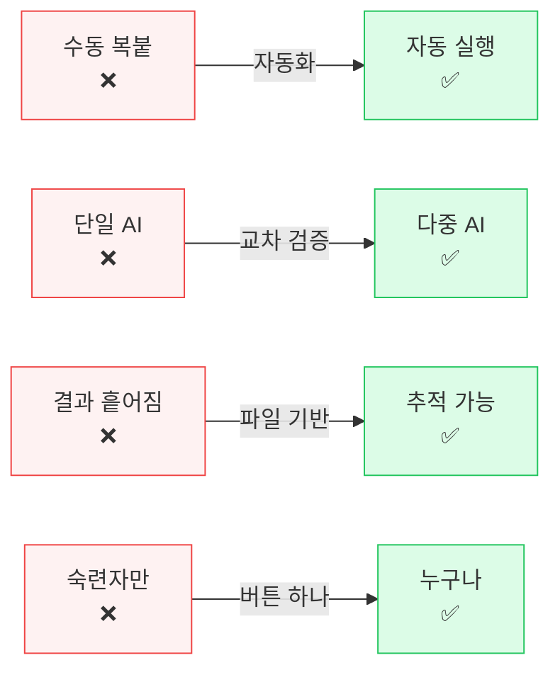
